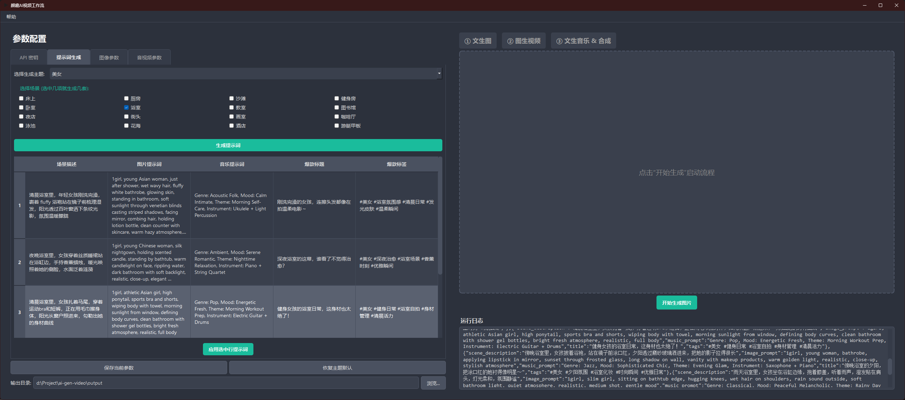

# AI Video Workflow: A Fully Automated AI-Native Video Generation Pipeline

[简体中文](./README.md) | [English](./README_en.md)

[](https://github.com/toki-plus/ai-video-workflow/stargazers)
[](https://github.com/toki-plus/ai-video-workflow/network/members)
[](https://choosealicense.com/licenses/mit/)
[](https://github.com/toki-plus/ai-video-workflow/pulls)

**`AI Video Workflow` is a free, open-source desktop application that chains multiple top-tier AI models (Text-to-Image, Image-to-Video, Text-to-Music) into a fully automated, AI-native video creation pipeline.**

Do you want to create eye-catching AI short videos but are troubled by tedious platform switching, complex parameter tuning, and a lack of creative inspiration? This project aims to simplify the entire process of AI video creation into just a few clicks, allowing anyone to easily generate short videos with unique visual styles and custom soundtracks.

<p align="center">
  <a href="https://www.bilibili.com" target="_blank">
    
  </a>
  <br>
  <em>(Click the image to watch the HD demo video on Bilibili)</em>
</p>

---

## ✨ Core Features

This is not just a tool, but a complete AIGC creation ecosystem:

-   **🤖 Fully Automated AI Creation Pipeline**:
    -   **Text-to-Image**: Integrates with the **LibLibAI** platform, supporting a rich set of Checkpoints, LoRA models, and parameters to turn your ideas into stunning images.
    -   **Image-to-Video**: Calls the **Jimeng I2V** model from Volcengine to bring static images to life, generating smooth and natural dynamic videos.
    -   **Text-to-Music**: Connects to the **Jimeng Music** model from Volcengine, allowing you to generate unique background music simply by describing its style, mood, or instruments.
    -   **Automatic Merging**: Uses the powerful **FFmpeg** engine to seamlessly merge the generated video with the background music into a final polished product.

-   **💡 AI-Powered Inspiration Engine**:
    -   Features a built-in prompt generator powered by the **Doubao (Doubao) Large Language Model**.
    -   Offers various preset themes like "Beauty" and "Labubu." Simply check the styles you want (e.g., "Beach," "Gym," or "Candy," "Magic"), and it will generate a full set of professional prompts for images and music, along with viral titles and tags.

-   **🎨 Intuitive Graphical User Interface (GUI)**:
    -   **Three-Step Workflow**: Clearly divides the creation process into three stages: "Text-to-Image → Image-to-Video → Text-to-Music & Merge," with the progress and results of each step visible at a glance.
    -   **Centralized Parameter Management**: Configure all AI model parameters in a unified interface, eliminating the need to switch between multiple websites or applications.
    -   **Real-time Media Preview**: Generated images and videos are displayed and played directly in the interface, allowing for immediate feedback.
    -   **History & Navigation**: Easily switch between multiple generated images to select the best one for the next step.

## 📸 Screenshots

<p align="center">
  
  <br>
  <em>Software Main Interface: Prompt Generation section.</em>
</p>
<p align="center">
  
  <br>
  <em>Software Main Interface: Image Parameters section.</em>
</p>

<table align="center">
  <tr>
    <td align="center" valign="top">
      
      <br />
      <em>Generation Example: Generated Image.</em>
    </td>
    <td align="center" valign="top">
      
      <br />
      <em>Generation Example: Final Video.</em>
    </td>
  </tr>
</table>

## 🚀 Quick Start

### System Requirements

1.  **Python**: 3.8 or higher.
2.  **FFmpeg**: **Must** be installed and added to the system's PATH environment variable.
    -   Visit the [FFmpeg official website](https://ffmpeg.org/download.html) for installation instructions.
    -   To check, open a terminal/command prompt and type `ffmpeg -version`.
3.  **API Keys**:
    -   **Doubao API Key**: For prompt generation.
    -   **LibLibAI Access Key & Secret Key**: For Text-to-Image.
    -   **Volcengine (Jimeng) Access Key & Secret Key**: For Image-to-Video and Text-to-Music.

### Installation & Launch

1.  **Clone the repository:**
    ```bash
    git clone https://github.com/toki-plus/ai-video-workflow.git
    cd ai-video-workflow
    ```

2.  **Create and activate a virtual environment (recommended):**
    ```bash
    python -m venv venv
    # On Windows
    venv\Scripts\activate
    # On macOS/Linux
    source venv/bin/activate
    ```

3.  **Install dependencies:**
    ```bash
    pip install -r requirements.txt
    ```

4.  **Configure API Keys:**
    -   **Highly recommended:** Configure keys via system environment variables, which the application will read automatically:
        - `DOUBAO_API_KEY`
        - `LIBLIB_AK`, `LIBLIB_SK`
        - `JIMENG_AK`, `JIMENG_SK`
    -   Alternatively, you can manually enter them in the "API Keys" tab after launching the software.

5.  **Run the application:**
    ```bash
    python ai_video_workflow.py
    ```

## 📖 Usage Guide

1.  **Step 1: Configuration & Preparation**
    -   Launch the app, go to the "API Keys" tab on the left, ensure all keys are entered correctly, and click "Save Current Parameters."
    -   Switch to the "Prompt Generation" tab, select a theme (e.g., "Beauty"), check a few scenes, and click "Generate Prompts."
    -   In the table below, select your favorite row and click "Apply Prompts from Selected Row."

2.  **Step 2: Text-to-Image**
    -   Parameters will be auto-filled in the "Image" and "Audio/Video" tabs; you can also modify them manually.
    -   In the right-hand workflow panel, click "Generate Image." The generated image will appear in the preview area.
    -   You can generate multiple images and use the "Previous"/"Next" buttons to choose the best one.

3.  **Step 3: Image-to-Video**
    -   After selecting your desired image, click "Generate Video." The app will send the image to the AI model for processing.
    -   Once complete, the silent video will loop automatically in the preview area.

4.  **Step 4: Text-to-Music & Merge**
    -   Click "Merge Final Video." The app will use the music prompt from the "Audio/Video" tab to generate a soundtrack and merge it with the video.
    -   Upon completion, the final video with audio will play in the preview area and be saved to the `output` folder.

5.  **Done!**
    -   Click "Reset All" to clear the current state and start a new creation.

---

<p align="center">
  <strong>For technical discussions and updates, please add:</strong>
</p>
<table align="center">
  <tr>
    <td align="center">
      
      <br />
      <sub><b>Personal WeChat</b></sub>
      <br />
      <sub>ID: toki-plus (Please note "GitHub Customization")</sub>
    </td>
    <td align="center">
      
      <br />
      <sub><b>Official Account</b></sub>
      <br />
      <sub>Get the latest tech shares and project updates</sub>
    </td>
  </tr>
</table>

## 📂 My Other Open Source Projects

-   **[Auto USPS Tracker](https://github.com/toki-plus/auto-usps-tracker)**: An efficient USPS bulk package tracker for e-commerce sellers, featuring anti-blocking scraping and formatted Excel report generation.
-   **[AI Mixed Cut](https://github.com/toki-plus/ai-mixed-cut)**: A groundbreaking AI content re-creation engine that deconstructs viral videos into a creative library and automatically generates new, original videos using a "Deconstruct-Reconstruct" model.
-   **[AI Highlight Clip](https://github.com/toki-plus/ai-highlight-clip)**: An AI-driven intelligent clipping tool that automatically analyzes, discovers, and clips multiple "highlight moment" short videos from long-form content, and generates viral titles.
-   **[AI TTV Workflow](https://github.com/toki-plus/ai-ttv-workflow)**: An AI-powered Text-to-Video tool that automatically converts any script into a short video with voiceover, subtitles, and a cover image, supporting AI script extraction, re-creation, and translation.
-   **[Video Mover](https://github.com/toki-plus/video-mover)**: A powerful, fully automated content creation pipeline. It automatically monitors and downloads videos from specified creators, performs deep, multi-dimensional video deduplication, uses an LLM to generate viral titles, and auto-publishes to different platforms.
-   **[AB Video Deduplicator](https://github.com/toki-plus/AB-Video-Deduplicator)**: Utilizes an innovative "High-Framerate Frame-Mixing" technique to fundamentally alter a video's data fingerprint, designed to bypass originality detection and deduplication mechanisms on major short-video platforms.

## 🤝 Contributing

Contributions of any kind are welcome! If you have ideas for new features, found a bug, or have any suggestions for improvement, please:
-   Submit an [Issue](https://github.com/toki-plus/ai-video-workflow/issues) to start a discussion.
-   Fork this repository and submit a [Pull Request](https://github.com/toki-plus/ai-video-workflow/pulls).

If this project has been helpful to you, please consider giving it a ⭐!

## 📜 License

This project is open-sourced under the MIT License. See the [LICENSE](LICENSE) file for details.
