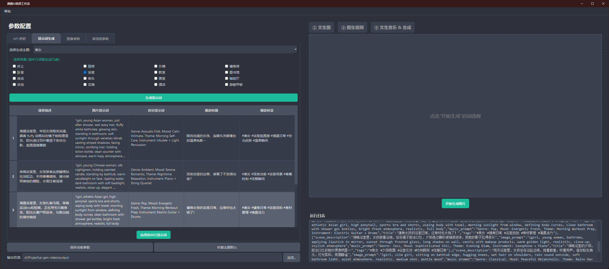
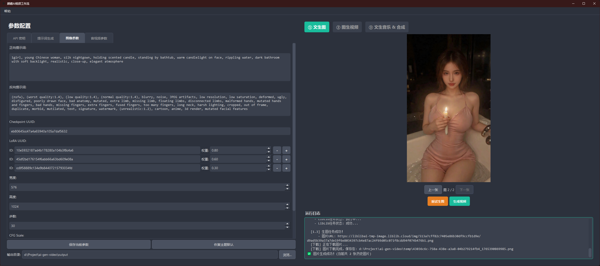

# AI Video Workflow

[简体中文](./README.md) | [English](./README_en.md)

A workflow prototype for coordinating multiple generative-AI services in video production.

The project connects prompt generation, text-to-image, image-to-video, text-to-music, and media composition in one desktop application. Its focus is cross-provider orchestration, state management, and human review points.

## Context

Generative-video workflows often depend on several models and vendors: one interprets the brief, another creates images, and others generate video or music. Moving prompts and files manually between services increases waiting time, version-management overhead, and retry effort.

AI Video Workflow organizes the steps into a visual pipeline and allows users to review and select outputs at key stages.

## Capabilities

- **LLM prompt generation**: a built-in prompt generator powered by the Doubao LLM offers preset themes and scene combinations, producing a full set of image and music prompts plus draft titles and tags in one click (confirmed by a human before publishing)
- **Text-to-image**: submits jobs to the LibLibAI platform with a wide choice of Checkpoints, LoRA models, and sampling parameters; candidates can be generated repeatedly and compared
- **Image-to-video**: calls the Volcengine Jimeng I2V model to turn a selected still image into a smooth, natural-looking clip
- **Text-to-music**: connects to the Jimeng music model to generate a custom soundtrack from a text description of style, mood, and instrumentation
- **Asynchronous job orchestration**: polls task status across providers, collects output files, handles failure boundaries, and manages multiple candidate image, video, and audio versions
- **Composition with human selection points**: FFmpeg composes the final video from the generated footage and music; prompt confirmation, image selection, and final review all remain human decisions, with page-through navigation for comparing candidate images
- **Three-stage desktop interface**: the creation process is divided into "text-to-image → image-to-video → text-to-music & composition" stages, with centralized parameters, live media previews, task-state management, and a one-click reset in a PyQt5 UI

## 📸 Screenshots

<p align="center">
  
  <br>
  <em>End-to-end example: from prompts to a finished video with soundtrack (animated demo).</em>
</p>
<p align="center">
  
  <br>
  <em>Main interface: prompt generation section.</em>
</p>
<p align="center">
  
  <br>
  <em>Main interface: image parameters section.</em>
</p>
<p align="center">
  
  <br>
  <em>Generation example: a candidate image before image-to-video.</em>
</p>

## Workflow

```text
Creative brief
    -> Prompt generation
    -> Human review
    -> Text-to-image
    -> Image selection
    -> Image-to-video
    -> Music generation
    -> Media composition
    -> Final review
```

## Technical Design

- `LiblibClient`: text-to-image submission and status polling
- `JimengI2VClient`: image-to-video provider adapter
- `JimengMusicClient`: music-generation provider adapter
- `AIGenerationPipeline`: cross-service orchestration with unified async polling, timeouts, and failure recovery
- `PromptGenerationStrategy`: extensible prompt strategies; preset themes and scenes register as strategies
- `MainWindow`: parameter, preview, and task-state management

Core technologies: Python, PyQt5, the Volcengine SDK, LibLibAI APIs, and FFmpeg/media-processing libraries.

## Quick Start

### Requirements

- Python 3.8+
- FFmpeg available on `PATH` (verify with `ffmpeg -version`)
- Valid credentials for the configured providers: a Doubao API key (prompt generation), LibLibAI Access/Secret keys (text-to-image), and Volcengine Access/Secret keys (image-to-video and text-to-music)

### Installation & Launch

1. Clone the repository and create a virtual environment:

```bash
git clone https://github.com/toki-plus/ai-video-workflow.git
cd ai-video-workflow
python -m venv venv
# Windows: venv\Scripts\activate
# macOS/Linux: source venv/bin/activate
```

2. Install dependencies:

```bash
pip install -r requirements.txt
```

3. Configure credentials (environment variables are recommended and read automatically; they can also be entered in the "API Keys" tab after launch):

```text
DOUBAO_API_KEY
LIBLIB_AK
LIBLIB_SK
JIMENG_AK
JIMENG_SK
```

4. Run the application:

```bash
python ai-video-workflow.py
```

A typical session: pick a theme and scenes to generate prompts and confirm them → generate images and page through the candidates → run image-to-video → generate the soundtrack and compose the final video (outputs are saved to the `output` directory, and the workflow can be reset at any time).

## Limitations and Responsible Use

- Provider APIs, quotas, and model behavior may change.
- Generated outputs require human review and must comply with copyright and provider terms.
- API credentials must remain in secure local configuration and never be committed.
- The current implementation is a workflow prototype and does not yet include comprehensive automated tests or CI.

## What This Project Demonstrates

The core value is not a single generated asset. It is the abstraction of multiple model providers, asynchronous job orchestration, failure boundaries, and human approval points: each provider is wrapped as a replaceable client, prompt strategies are extensible, and output at key stages advances only after a human selects it.

## 📂 More Projects

- [video-mover](https://github.com/toki-plus/video-mover) — Automated multi-platform content distribution pipeline: media processing, metadata generation, scheduling, platform adapters
- [ai-highlight-clip](https://github.com/toki-plus/ai-highlight-clip) — Long-video smart triage: Whisper transcription + LLM scoring + human review
- [ai-ttv-workflow](https://github.com/toki-plus/ai-ttv-workflow) — Desktop text-to-video workflow with human-in-the-loop checkpoints
- [ai-mixed-cut](https://github.com/toki-plus/ai-mixed-cut) — Video re-creation workflow via structured asset library and script reassembly
- [ai-trader-for-mt4](https://github.com/toki-plus/ai-trader-for-mt4) — LLM×MT4 controlled-execution framework: constrained tools, risk rules, state management
- [ai-trader-for-mt5](https://github.com/toki-plus/ai-trader-for-mt5) — AI trading assistant and EA engineering framework for MetaTrader 5
- [auto-usps-tracker](https://github.com/toki-plus/auto-usps-tracker) — Batch shipment tracking and Excel reporting for cross-border e-commerce
- [AB-Video-Deduplicator](https://github.com/toki-plus/AB-Video-Deduplicator) — Experimental video re-creation tool based on high-frame-rate blending
- [netease-downloader](https://github.com/toki-plus/netease-downloader) — Netease Cloud Music desktop downloader: QR login, queue, ID3 tagging

## License

See [LICENSE](./LICENSE).
